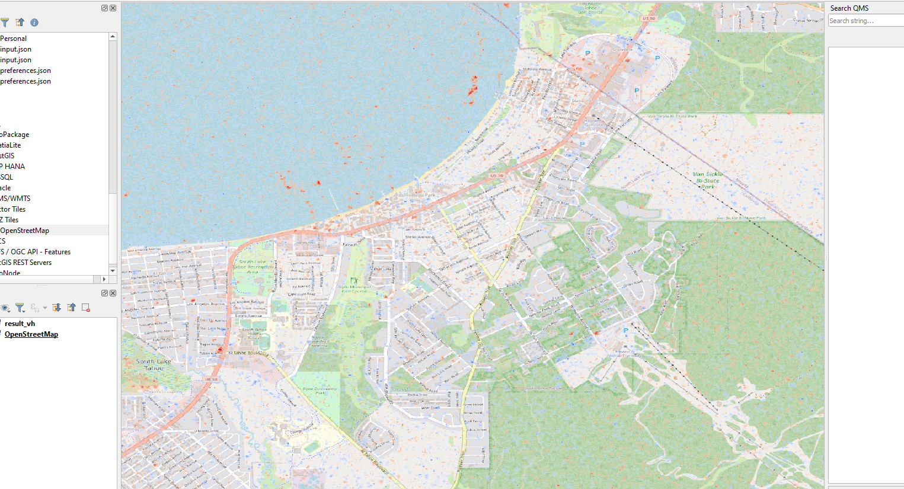

# Change Detection Algorithm

This algorithm determines the difference between two SAR imagery files, using the 'log-ratio scaling' method.

## Prerequisite

To run the script, libraries are required.

- GDAL
- rasterio
- numpy

These can be installed in a new virtual env or found in a pre-existing docker image [Development Seed](https://developmentseed.org/blog/2017-08-17-introducing-geolambda) offers.

## How to

The script can be ran from the command line or included in a project as an import.

### Command line

The python script can be ran from the command line. Two arguments are required, an input and output file path, name.

`python changedetect/detect.py input_previous.tif input_latest.tif area.json output.tif`

**Optional arguments** include `--crs`.

Including `--crs` tells the app which project to read the tif files in as and export the result.

#### Example

*From README directory*

`python changedetect/detect.py sample/s1a-iw-grd-vv-20220705.tiff sample/s1a-iw-grd-vv-20221220.tiff sample/feature_collection.json output/result_vv.tif`

The geotif included (`output/result_vv.tif`) was generated by the above command.



### Importing

Once the repo is built/installed with python's setup tools (`python setup.py develop`), you can access key functions to calculate difference values.

`from changedetect import evaluate_geotiff_differences`

Once imported, this function can be used to determine differences between SAR GRD GeoTiffs.

#### Example Usage

```
from changedetect import evaluate_geotiff_differences
    
if __name__ == "__main__":
    fn_in_p = 'sample-20220501.tif'
    fn_in_l = 'sample-20221201.tif'
    fn_area = 'sample/area.json'
    fn_out = 'output.tif'
    evaluate_geotiff_differences(fn_in_p, fn_in_l, fn_area, fn_out, crs='EPSG:4326')
```

Further documentation is included on the functions.